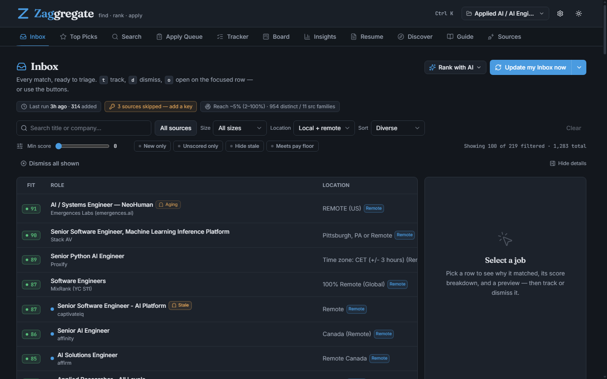
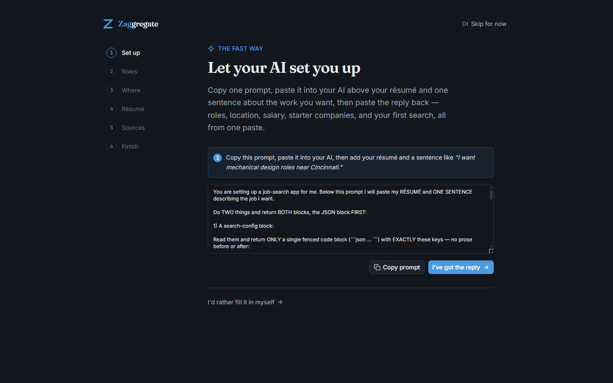

# Zaggregate

**A job search that works for you — on your own computer, on your side.**

Zaggregate finds jobs across roughly 20 sources at once, scores how well each
one fits _your_ preferences, and helps you apply — without ever uploading your
data or applying on your behalf. It's free, needs no account, and is built to be
used **with** the AI you already have.



**Download for Windows:** green **Code** button → **Download ZIP** → extract → open [`Executables/JobProgram`](Executables/) → double-click a launcher. That's the whole install. Prefer source? See [Quick start](#quick-start-run-from-source).

## The fast way: let your AI set it up

The quickest path from download to a running search is **one round-trip with any
AI chat** (Claude, ChatGPT, Gemini, Copilot — a free tier is fine):

1. Click **Set up with AI**. It copies one ready-made prompt to your clipboard.
2. Paste it into your AI, add your résumé plus one sentence about the work you
   want (e.g. _"mechanical design roles near Cincinnati"_), and send it.
3. Paste the whole reply back into Zaggregate.

That single paste fills in your roles, location, salary, and seniority, adds a
starter list of local employers to watch, **and kicks off your first search** —
no keys, no accounts, nothing uploaded. Prefer to do it by hand? The manual
setup wizard is always there too.



## Why it's different

- **It finds jobs for you, across ~20 sources.** One search pulls from free
  public feeds (Adzuna, USAJobs, CareerOneStop / the National Labor Exchange,
  Jooble, Careerjet, The Muse, RemoteOK, Remotive, Jobicy, Himalayas,
  WeWorkRemotely, Working Nomads, Hacker News "Who is hiring?", and more) plus
  the company career pages you add across many ATS platforms (Greenhouse, Lever,
  Ashby, Workday, SmartRecruiters, Workable…). Any field — nurse, teacher,
  welder, driver, engineer — not just tech.
- **100% local and private.** No account, no cloud, no telemetry, no data sale.
  Your resume, preferences, scores, and application tracker live in a local
  folder and never leave your machine. See [PRIVACY.md](PRIVACY.md) — the short
  version is five lines.
- **Free, no sign-up.** There's no paywall and no account to create. Optional
  free job-source keys and your own AI make it better, but you can start with
  neither.
- **Ghost-job shielding.** Boards bury you in stale and reposted listings.
  Zaggregate flags postings that look aged or repeatedly reposted and shows an
  honest estimate of how much of your local market it can actually see — so you
  can trust the shortlist instead of guessing. It flags; it never silently hides
  your jobs.
- **Bring your own AI.** Rank and tailor with any AI chat you already use
  (Claude, ChatGPT, Gemini, Copilot — a free tier is fine), by copy-and-paste,
  no key required. Add your own API key only if you want it hands-off.
- **Assisted, never auto-apply.** Zaggregate aggregates, de-dupes, scores, and
  helps you tailor a resume and cover letter — then **you** click submit. It
  never sprays applications; mass auto-apply gets filtered out as spam and you
  stay in control.

## Why Zaggregate — own your data, apply on purpose

Every other job tool is cloud SaaS that ingests your résumé. Zaggregate is
local-first by design, and that turns two industry-wide problems into features:

- **Own your data.** A 2025 study found **90% of job platforms sell user data**
  (8 of 9 investigated sell it under CCPA; ZipRecruiter, Monster, and LinkedIn
  ranked most invasive). Zaggregate has no account, no cloud, and no telemetry —
  your résumé, preferences, scores, and tracker never leave your machine. This is
  a moat no SaaS rival can answer.
  ([inc](https://www.inc.com/bruce-crumley/90-percent-of-job-platforms-sell-user-data-study-finds-here-are-the-biggest-offenders/91358104),
  [incogni](https://blog.incogni.com/are-job-search-platforms-exploiting-job-seekers-for-their-personal-data/))
- **Assisted, not auto-apply.** Bulk auto-apply bots succeed at roughly
  **0.01% per application (1 in 10,000)** versus **4–6% for a tailored
  application** — and recruiters are actively AI-filtering the spam (Greenhouse's
  CEO calls it a hiring "doom loop"; Wonsulting shut its bulk-send feature in
  Aug 2025). Zaggregate aggregates, de-dupes, scores, and helps you tailor — then
  **you** click submit. Tailored, not sprayed.
  ([forbes](https://www.forbes.com/sites/robinryan/2025/09/22/ai-auto-apply-job-tools-recruiters-warning/),
  [cnn](https://www.cnn.com/2025/12/21/economy/ai-hiring-complication))
- **Honest reach, not ghost-job opacity.** Zaggregate tells you what fraction of
  your local market it can actually see (a "reach" badge) and flags when top
  results may be poor fits — the opposite of the outdated/ghost postings and
  résumé hallucinations reviewers hit with the auto-apply "agents."
  ([flashfire](https://www.flashfirejobs.com/blog/is-jobright-ai-legit))

## Quick start (the packaged app)

Download the repository (green **Code** button → **Download ZIP**; app-only
zips also land on the [Releases page](https://github.com/alex-zagorianos/Zaggregate/releases))
and extract it, then:

1. Open the [`Executables/JobProgram`](Executables/) folder and run
   **`JobProgram.exe`** (or one of the launchers next to it).
2. A short **Setup wizard** asks what jobs you want, where, your salary, and your
   resume — or use **Set up with AI** to do it in one paste.
3. Open your Inbox and click **Update my Inbox now**, or use the Search tab.

First time only, Windows may warn about an "unknown publisher" (the app is safe,
it just isn't code-signed yet). `JobProgram/FIRST-RUN.txt` shows the two safe
ways past it, or just double-click `JobProgram/launch.bat`.

### App modes (the same exe)

`JobProgram.exe` runs three ways — the packaged `JobProgram` folder ships a
double-clickable launcher for each, so nobody has to type flags:

- **`JobProgram.exe`** (or `launch.bat`) — the default desktop app (classic Tk
  window).
- **`Zaggregate Desktop.bat`** (= `JobProgram.exe --desktop`) — the modern web
  UI in a native desktop window (no browser needed; falls back to browser mode
  if the desktop runtime is missing).
- **`Zaggregate Web.bat`** (= `JobProgram.exe --web`) — the modern web UI in
  your default browser at `http://127.0.0.1:5002/app` (loopback only — nothing
  is exposed off your machine).

(There is also a headless `--daily` mode used by the scheduled daily update.)

## Quick start (run from source)

Requires Python 3.12 on Windows (`py -3.12`).

```
py -3.12 -m pip install -r requirements.txt
py -3.12 src\gui.py                 # default desktop app (classic Tk window)
cd src
py -3.12 -m webui                   # modern web UI in the browser (127.0.0.1:5002/app)
py -3.12 -m webui --desktop         # modern web UI in a native window
```

The web UI ships a pre-built front end, so no Node/npm is needed to run from
source. See [docs/BUILD.md](docs/BUILD.md) to rebuild the front end or the exe.

### Build the distributable exe

```
py -3.12 -m pip install pyinstaller
py -3.12 src\build_package.py                # -> dist/Zaggregate-v<version>.zip (repo root)
py -3.12 src\build_package.py --production   # -> a ready-to-run production/ folder (repo root)
```

The zip is a folder a friend unzips and runs with no Python install. Each built
zip ships alongside a `SHA256SUMS.txt` so a download can be verified. Full
details are in [docs/BUILD.md](docs/BUILD.md).

## What's in the app

Zaggregate is organized into tabs, each a step in the search-to-apply loop:

| Tab             | What it's for                                                                  |
| --------------- | ------------------------------------------------------------------------------ |
| **Inbox**       | Your daily matched feed, ranked best-first; triage with Track / Dismiss / Open |
| **Top Picks**   | A short AI-assisted shortlist of the strongest matches from your inbox         |
| **Search**      | Run a one-off search for any role in any location, on demand                   |
| **Apply Queue** | Everything you marked Interested; tailor documents and mark jobs applied here  |
| **Tracker**     | Every application and its status (Interested → Applied → Interview → Offer …)  |
| **Board**       | The same tracked applications as a drag-and-drop pipeline board                |
| **Insights**    | Your funnel, per-source interview rates, and application cadence               |
| **Resume**      | Generate a tailored resume + cover letter for any posting you paste in         |
| **Discover**    | BYO-AI suggestions for adjacent roles and companies worth searching            |
| **Guide**       | The full in-app how-to, from first run to browser extension and beyond         |
| **Sources**     | Connect optional free job-source keys and see which are active                 |

## Bring your own AI (two channels)

1. **Clipboard round-trip (free, no key, any chatbot).** Click _Ask AI to rank
   these_ — it copies a ready-made prompt (your preferences + the jobs) to the
   clipboard. Paste it into any AI chat, copy the reply, and click _Paste AI
   ranking_. Each job's Fit grade lands back on the right row.
2. **MCP server (Claude Code / MCP clients).** The `claude-code/` folder ships an
   MCP server so an agent can drive search, ranking, and the application cycle
   directly. See `claude-code/` for setup.

An optional API key (Tools ▸ _Connect your AI_) enables hands-off auto-ranking
and AI resume/cover-letter drafting. Any Anthropic-compatible endpoint works
(including local Ollama, GLM, DeepSeek, Kimi via a base-URL setting).

## Architecture

Zaggregate runs on a wide-net pipeline: source clients fetch and normalize
postings, a cross-source dedup collapses the same job seen on many boards, a
permissive hard gate drops only explicit dealbreakers, a local 0–100 fit score
ranks what's left, and the result lands in your **Inbox**. From there you triage,
optionally send the batch to your own AI for a second-opinion _Fit_ grade, and
move keepers through the **Apply Queue** and **Tracker**.

Entry points: `gui.py` (classic desktop app), `webui/` (modern web UI,
`py -m webui`), `daily_run.py` (headless daily search → inbox),
`search/cli.py` (command line), `mcp_server.py` (MCP). The deep technical map is
in **[docs/ARCHITECTURE.md](docs/ARCHITECTURE.md)**; the day-to-day how-to is in
**[docs/USER-GUIDE.md](docs/USER-GUIDE.md)**; the build/packaging story is in
**[docs/BUILD.md](docs/BUILD.md)**.

Application logs are written to `<data folder>/logs/app.log` (rotating). Use
Help ▸ _Report a problem_ to package logs + version for support — it never
includes your API keys or resume.

## Repository layout

A quick map for anyone reading the source. Application code lives under `src/`
(a flat set of root modules — `config.py`, `models.py`, `ranker.py`, … — plus a
handful of focused packages); the repo root holds docs, tests, and your own
data folder:

```
README.md, LICENSE, EULA.txt, PRIVACY.md   Top-level docs and terms
CLAUDE.md, _index.md                       Project brain entry points
Executables/      The ready-to-run Windows app (exe + launchers) — just open and run
docs/             Build guide, known issues, and per-session development handoffs
brain/            Design notes, plans, and review logs kept as an open development journal
tests/            Test suite (py -3.12 -m pytest, run from the repo root)
src/              All application code (see below)

src/
  gui.py            Desktop app (tkinter) — the default entry point
  daily_run.py      Headless daily search that fills your inbox (scheduled runs)
  mcp_server.py     MCP server so an AI agent can drive the app
  build_package.py  Builds the distributable exe/zip (see docs/BUILD.md)
  config.py         Settings, paths, and feature flags
  models.py         Core data types (Job, scores) shared across the app

  search/           Job-source clients (Adzuna, USAJobs, RemoteOK, …) + the search engine
  scrape/           Company career-page scrapers, one per ATS (Greenhouse, Lever, Workday, …)
  match/            Fit-scoring: rubric, salary, ghost-job flags, skill-gap
  discover/         Finds new companies/boards to add to your search
  coverage/         Estimates how much of your local market the app can see ("reach")
  resume/           Resume + cover-letter generation and tailoring
  rerank/           Import/export for the bring-your-own-AI ranking round-trip
  ui/               Desktop (tkinter) tabs and dialogs
  webui/            Modern web UI — Flask API (webui/) + React front end (webui/frontend/)
  tracker/          Local SQLite application tracker (tracker.db lives in your data folder)
  browser_ext/      Chrome/Edge extension (MV3) for capturing jobs off any page

  data_static/      Shipped reference data (metro tables, alt job titles, CA cert)
  data_templates/   Starter files copied into your data folder on first run
  companies.json    Built-in starter company registry (merged with yours at runtime)
  scripts/          One-off maintenance/build helpers (run directly, not imported by the app)
  claude-code/      MCP server setup for driving the app from Claude Code / MCP clients
  legacy/           Retired code kept for reference, not imported by the app
  packaging/        Packaging assets consumed by build_package.py
  app.spec          PyInstaller onedir spec (see docs/BUILD.md)
```

Your own data — preferences, resume, scores, and tracker — never lives in the
repo; it's written to a local data folder at the repo root (resolved by
`src/config.py`) and is git-ignored. See the [Architecture](#architecture)
section above for the entry points and `_index.md` for the deeper map.

## Developed in the open

`brain/` and `docs/handoffs/` are an intentional, unedited development journal —
the plans, reviews, and per-session handoffs that produced this app are kept in
the repo for transparency, not polish. The finished documentation is this README
and everything under `docs/`.

## Privacy & terms

- **[PRIVACY.md](PRIVACY.md)** — how your data is handled (short version: it
  stays on your computer).
- **[EULA.txt](EULA.txt)** — beta terms of use. Zaggregate is provided as-is;
  you query job sources on your own behalf and are responsible for complying
  with each source's terms.

## License

**[AGPL-3.0](LICENSE)** (GNU Affero General Public License v3.0). In plain
terms: use it, read it, modify it, share it freely — but if you distribute a
modified version, or offer a modified version to others over a network, your
modifications must be published under the same license. Your own local use is
never affected. The packaged beta additionally ships the disclaimers in
`EULA.txt` (as-is / own-behalf-querying notices of the kind AGPL §7 permits).

Contributions are accepted under AGPL-3.0 with a
[Developer Certificate of Origin](https://developercertificate.org/) sign-off
(`git commit -s`) — this keeps future licensing options (e.g. commercial
exceptions for institutions) available to the project.
