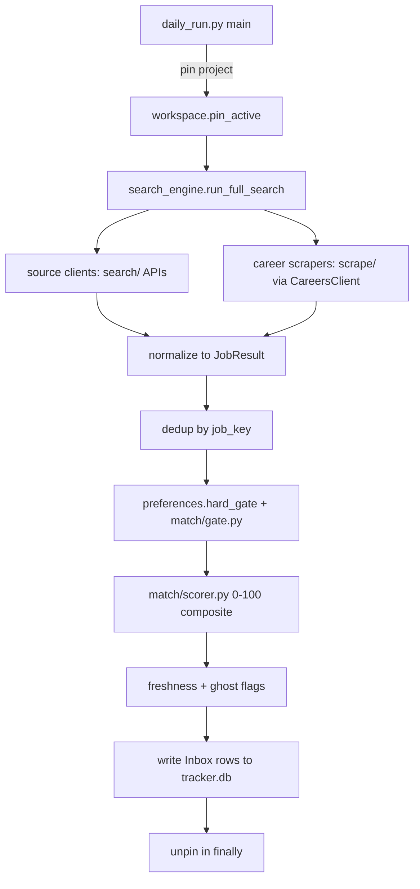
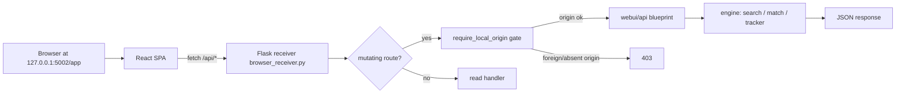
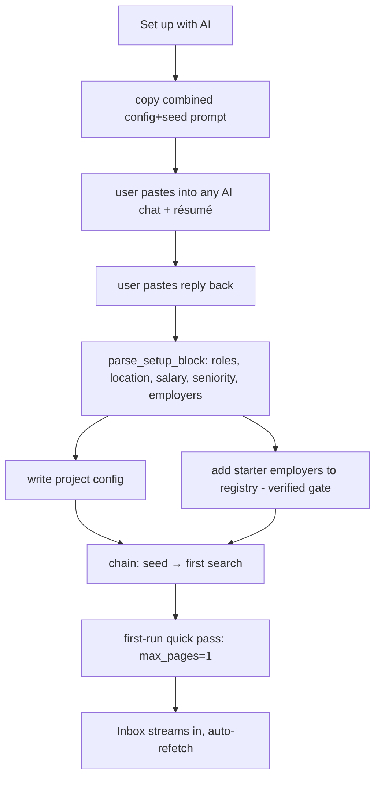

# Zaggregate Architecture

This document explains how Zaggregate works, through two lenses:

- **[Concepts](#concepts)** — the domain pipeline and the ideas behind it: how a
  job goes from a raw listing on twenty sources to a scored, triaged row in your
  Inbox and on into your application tracker.
- **[Codebase](#codebase)** — a module-by-module map of the source tree, the
  request/data-flow diagrams, and the key design decisions with their rationale.

The day-to-day how-to is in [USER-GUIDE.md](USER-GUIDE.md); the build and
packaging story is in [BUILD.md](BUILD.md).

---

## Concepts

### The domain pipeline

Every search — whether triggered from the Inbox, the Search tab, the CLI, or the
scheduled daily run — flows through the same pipeline:

```
source clients ─▶ fetch / normalize ─▶ dedup ─▶ hard gate ─▶ fit score ─▶ Inbox
                                                                             │
                                            triage (track / dismiss / open) ─┤
                                                                             ▼
                                     BYO-AI re-rank round-trip ──▶ Apply Queue ──▶ Tracker / Board
```

1. **Source clients → fetch / normalize.** A wide set of source clients
   (`search/`) each know how to query one job source — free aggregators (Adzuna,
   USAJobs, CareerOneStop, Jooble, Careerjet, The Muse, RemoteOK, Remotive,
   Jobicy, Himalayas, WeWorkRemotely, Working Nomads, Hacker News, and more) plus
   the company career-page scrapers (`scrape/`), one per ATS platform
   (Greenhouse, Lever, Ashby, Workday, SmartRecruiters, Workable, …). Each client
   owns its own parsing and returns a normalized `JobResult` (`models.py`). A
   missing credential skips that source with a warning instead of crashing —
   graceful degradation is a hard rule.

2. **Dedup.** The same job appears on many boards. A stable **`job_key`**
   collapses duplicates across sources, and career-scraper jobs additionally
   carry a **`board_count`** (how many postings the company's board had), used
   later as a company-size signal. Dedup is cross-source: a role seen on both
   Adzuna and a company's Greenhouse is one row.

3. **Hard gate (dealbreakers only).** A cheap, pre-AI filter
   (`preferences.hard_gate`, with a second structural pass in `match/gate.py`)
   drops a job **only** when it clearly violates a hard constraint — an explicit
   dealbreaker token, a confidently-parsed sub-floor salary, an explicit
   location mismatch with no remote signal, or a disallowed employment type.
   This is the project's core philosophy — **inclusion over precision**: get as
   many potential jobs in front of the user as possible and let _them_ do the
   final dropping. Unknowns (no salary, no location) are kept. The gate prefers
   down-ranking to dropping, and showing to down-ranking.

4. **Composite fit score.** What survives the gate is scored 0–100 by the local
   scorer (`match/scorer.py`) with **zero API calls**, so every search surfaces
   best-fit jobs first even with no AI connected. The composite weights are:

   | Component     | Weight | What it measures                                                     |
   | ------------- | ------ | -------------------------------------------------------------------- |
   | Title match   | 35     | search keywords found in the job title                               |
   | Skill overlap | 25     | résumé skill terms found in the description (missing = neutral)      |
   | Salary        | 15     | posted floor vs. your salary_min (missing = neutral)                 |
   | Location      | 15     | token proximity to your target location                              |
   | Recency       | 10     | posting age, exponential decay (10-day half-life; unknown = neutral) |

   The composite is **renormalized over the components actually present** (a
   missing salary or location doesn't drag the score down) and **shrunk toward a
   neutral 50 by a confidence factor** when few signals are available, so a
   thinly-described posting isn't over-ranked on a lucky title hit. An optional
   local **semantic-similarity** signal (`match/semantic.py`, off by default)
   can add a meaning-level match on top. Beyond the base composite, a
   **company-size modifier** nudges by board_count (small boards up, very large
   boards down), **exclude-keywords** subtract, and — only when a user explicitly
   targets management/exec — a bounded **seniority adjustment** ranks a genuine
   target-level role above an otherwise keyword-matching but below-level title.
   Missing signals are treated as _neutral_, never penalized, so the wide net is
   never over-cut.

5. **Inbox triage.** The scored, deduped result lands in your **Inbox**, ranked
   best-first. You triage with the keyboard — **T**rack, **D**ismiss, **O**pen —
   and filters narrow the _view_ only; nothing is ever deleted by a filter.

6. **BYO-AI re-rank round-trip.** The instant **Score** is a fast
   keyword-and-skills match. An optional second **Fit** grade comes from _your_
   AI: export the inbox plus a versioned prompt (`rerank/export.py`), paste it
   into any chatbot, and import the returned grades (`rerank/import_.py`,
   validated and `job_key`-joined, snapshotted for undo). No key is required —
   this is a clipboard/file round-trip. When Score and Fit disagree, Fit carries
   the nuance.

7. **Tracker / Board lifecycle.** Jobs you Track move to the **Apply Queue**,
   where you generate tailored documents and mark them applied. From there each
   application flows through the **Tracker** lifecycle —
   Interested → Applied → Phone screen → Interview → Offer → Accepted, with
   Rejected / Withdrawn / Ghosted terminal states and an Archive bucket. The
   **Board** is the same data as a Kanban pipeline.

### The project / workspace model

Zaggregate is multi-campaign. A **project** (`workspace.py`) is an isolated
search — its own preferences, company watch-list, inbox, and tracker DB. Exactly
one project is **active** at a time (recorded in `projects.json`), and the DB
path is resolved from that active project _on every call_
(`tracker.db.current_db_path`). This is what lets one install run several lanes —
different roles for one person, or a project per person you're helping.

Because the DB path follows the global active project, the **concurrency
invariant** is: never run two project-touching processes at once. A headless
`daily_run --project X` therefore **pins** the active project process-locally for
the whole run (`workspace.pin_active`) so a concurrent `projects.json` write —
a second run, or a GUI project switch — can't redirect its inbox/output/config
writes mid-run, and crucially it does _not_ flip the global active project the
user's GUI opens to next launch. Within a single process, the web layer's
`JobRunner` (`webui/jobs.py`) adds a single-flight lock per `(kind, key)` so two
engine jobs (a search and a daily run, say) never run at once in the same
server, and the GUI refuses a project switch while a pinned run is in flight
(`workspace.pinned()`).

### Freshness and ghost detection

A "ghost job" is a posting that isn't really being filled. Zaggregate can't
declare any single posting fake — nobody can, from the outside — so it surfaces
the signals boards hide: **freshness** (how long a posting has been up, in
`search/freshness.py`, with per-project run-state persisted) and **repost
history** and **company memory** (`match/ghost.py` — if you marked a company
"ghosted" in your tracker, its next posting is flagged). Critically, it **flags,
it never hides**: a stale-looking job keeps its score and stays in the Inbox with
a label, because a "stale-looking" job is sometimes still real.

### Reach estimation

Instead of pretending it sees the whole market, the Inbox shows an honest
**reach** estimate — what fraction of your local market the app is actually
pulling (`coverage/`). The coverage engine rates completeness with a three-leg
benchmark (a reference proxy, capture-recapture overlap, and a JOLTS gate), keyed
by the same stable `job_key`, and every new source is gated by a lift-test
proving it doesn't _lower_ coverage. The reach badge (backed by a small SerpApi
probe, `coverage/reach.py`) tells you when to add a source or a company rather
than assuming the well is dry.

### The BYO-AI seams — and why BYO-AI

Zaggregate is built to be used _with_ the AI you already have, through several
distinct seams, all of which are clipboard/file round-trips by default:

- **Setup prompt round-trip** — one paste configures your whole search and starts
  the first one (`ui/ai_setup.py`).
- **Seed prompt** — an AI builds your local-employer watch-list, pasted into
  Add Companies (`ui/seed_area.py`).
- **Re-rank export/import** — the Fit-grade round-trip above (`rerank/`).
- **Discover** — an AI suggests adjacent role _directions_ to search
  (`recommend.py`).

The choice to **bring your own AI** rather than bundle API calls is deliberate.
It keeps the app free and keyless on day one, keeps _your_ data on _your_ machine
(the only thing that leaves is the prompt _you_ choose to paste into _your_ own
chat), and lets you use whatever model you already pay for — free tiers included.
An optional API key unlocks the same features hands-off, pointed at any
Anthropic-compatible endpoint (including local Ollama), but it is never required.

### The security model

- **Loopback only.** The web UI binds `127.0.0.1` (never `0.0.0.0`) — nothing is
  exposed off your machine.
- **Origin-gated mutations.** Every mutating `/api/*` route is wrapped so a
  cross-site browser request (the sole threat: a hostile web page forging
  requests at your local server) is rejected; a header-less local caller can't be
  a cross-site forgery, but a mutating route still refuses to run a side effect
  for one.
- **No telemetry.** No account, no cloud, no analytics. Logs stay in your local
  data folder; the problem-report bundle never includes your keys or résumé.

### Packaging

One PyInstaller **onedir** build (`build_package.py` driven by `app.spec`)
produces the shippable exe. The **same Flask receiver** that accepts
browser-extension captures also serves the modern web UI (a pre-built React SPA)
at `127.0.0.1:5002/app`, so `--web` and `--desktop` get the web UI for free from
the frozen exe. The classic **tkinter** UI (`gui.py` + `ui/`) is the plain-exe
default and remains fully supported alongside the web UI. The internal name stays
`JobProgram` (data folder, version resource) on purpose — renaming it would
orphan existing users' data under `%LOCALAPPDATA%\JobProgram`.

---

## Codebase

### Module map

The app is a flat set of **root modules** plus focused **packages**. Paths are
relative to the repo root.

#### Root modules

| Module                                             | Role                                                                                                        | Key entry points                                            |
| -------------------------------------------------- | ----------------------------------------------------------------------------------------------------------- | ----------------------------------------------------------- |
| `config.py`                                        | Settings, paths, feature flags, `APP_VERSION` (single source of truth)                                      | `_get_user_data_dir()`, `USER_DATA_DIR`                     |
| `models.py`                                        | Core data types (`JobResult`) shared across the app                                                         | `JobResult`                                                 |
| `workspace.py`                                     | Project/workspace registry + the process-pin concurrency primitive                                          | `active_slug()`, `pin_active()`, `db_path()`                |
| `preferences.py`                                   | User preferences + the permissive `hard_gate` pre-filter                                                    | `hard_gate()`                                               |
| `ranker.py`                                        | Builds the one shared AI ranking prompt/parser used by paste, API, and MCP; wires the hard gate ahead of it | `build_request()`, `build_profile()`, `has_api_key()`       |
| `recommend.py`                                     | Discover: BYO-AI role-direction recommendations                                                             | `build_recommend_prompt()`, `parse_recommendations_reply()` |
| `daily_run.py`                                     | Headless daily search → inbox (scheduled runs); pins its project                                            | `main()`, `run_main()`                                      |
| `daily_run_core.py`                                | Tk-free core of the daily run, importable by the web layer                                                  | —                                                           |
| `gui.py`                                           | Classic tkinter desktop app (the plain-exe default)                                                         | `_build_tabs()`, Tools menu                                 |
| `mcp_server.py`                                    | MCP server so an AI agent can drive search/rank/apply directly (a data layer — it calls no AI itself)       | `search_jobs()`, `get_preferences()`, `mcp`                 |
| `industry_profile.py`                              | Field/industry routing — which categories/feeds a field turns on                                            | `resolve()`, `save_override()`                              |
| `insights.py`                                      | Funnel / per-source interview rates / cadence metrics                                                       | `funnel()`, `by_source()`, `cadence()`                      |
| `network.py` / `outreach.py`                       | Referral contact import/matching + BYO-AI outreach/follow-up/interview-prep prompt builders                 | `build_warm_path_prompt()`, `build_followup_prompt()`       |
| `notify_win.py`                                    | Optional opt-in Windows toast notifications                                                                 | —                                                           |
| `applog.py`                                        | Rotating app log + a secret-redacting scrubber                                                              | `redact()`                                                  |
| `userdata.py`                                      | First-run data-folder bootstrap (seeds templates, inits tracker.db)                                         | —                                                           |
| `claude_bridge.py`                                 | Optional hands-off AI calls to an Anthropic-compatible endpoint                                             | —                                                           |
| `dateparse.py`                                     | Posting-date parsing helpers                                                                                | —                                                           |
| `demo_data.py`                                     | The read-only SAMPLE inbox shown on a brand-new install                                                     | —                                                           |
| `build_package.py`                                 | Builds the distributable exe/zip and `production/` folder                                                   | see [BUILD.md](BUILD.md)                                    |
| `build_company_list.py` / `enumerate_companies.py` | Bulk company-registry seeding helpers                                                                       | —                                                           |

#### Packages

- **`search/`** — one client per job source (`adzuna_client.py`,
  `usajobs_client.py`, `careeronestop_client.py`, `jooble_client.py`,
  `careerjet_client.py`, `themuse_client.py`, `remoteok_client.py`,
  `remotive_client.py`, `jobicy_client.py`, `himalayas_client.py`,
  `weworkremotely_client.py`, `workingnomads_client.py`, `hn_client.py`,
  `serpapi_client.py`, `jsearch_client.py`, the education feeds `reap_client.py`
  / `edjoin_client.py` / `higheredjobs_client.py`, `nspe_client.py`, and more),
  all inheriting `base_client.py`. `search_engine.py` runs the full search and
  dedup; `query.py` and `keyword_strategy.py` build query terms;
  `source_registry.py` / `source_taxonomy.py` catalog the sources; `freshness.py`
  is the posting-age logic; `report_html.py` / `report_csv.py` render reports;
  `cli.py` is the command-line entry.
- **`scrape/`** — one scraper per ATS (`greenhouse_scraper.py`, `lever_scraper.py`,
  `ashby_scraper.py`, `workday_scraper.py`, `workday_cxs_scraper.py`,
  `smartrecruiters_scraper.py`, `workable_scraper.py`, `bamboohr_scraper.py`,
  `recruitee_scraper.py`, `teamtailor_scraper.py`, `vincere_scraper.py`,
  `oracle_orc_scraper.py`, `jsonld_scraper.py`, `direct_scraper.py`, and more).
  `careers_client.py` wraps these into the search pipeline; `ats_detect.py`
  probes and identifies a board; `company_registry.py` is the
  verified/unverified/browser-only company store; `browser_receiver.py` is the
  Flask receiver (port 5002) that accepts extension captures and serves the web
  UI; `tiering.py` / `company_health.py` / `inbox_health.py` are health/priority
  helpers.
- **`match/`** — the scoring family: `scorer.py` (the composite 0–100 score),
  `gate.py` (the structural pre-AI drop/down-rank/keep gate), `comp.py` (salary
  parsing), `facts.py` (seniority/fact extraction), `ghost.py` (ghost/repost/
  company-memory flags), `rubric.py`, `semantic.py`, `skillgap.py`,
  `language.py`, `ats_hint.py`.
- **`discover/`** — company/board discovery: `funnel.py` (the discovery funnel),
  `business_finder.py`, `career_link.py`, `cc_harvest.py` / `inbox_harvest.py`,
  `classify.py` / `detect.py`, `enumerate.py`, `seed_metro.py`,
  `jobhive_seed.py` / `dataset_seed.py`, `registry.py`.
- **`coverage/`** — the reach engine: `benchmark.py` (three-leg benchmark),
  `reach.py` (the Inbox reach badge), `estimators.py` / `independence.py` /
  `overlap_sample.py` (capture-recapture), `jolts.py` (the JOLTS gate),
  `reference.py`, `entity.py` / `resolve.py` (entity resolution), `geography.py`,
  `registry_coverage.py` / `registry_history.py`, `report.py`.
- **`resume/`** — `experience_parser.py` (parses `experience.md`),
  `generator.py` (the AI call → structured JSON), `docx_builder.py` (résumé +
  cover-letter Word docs), `service.py`.
- **`rerank/`** — the BYO-AI ranking round-trip: `export.py` (inbox + versioned
  prompt out), `import_.py` (validated grades back in), `schema.py`.
- **`freshness.py` logic** lives in `search/freshness.py` + `match/ghost.py`;
  per-project run-state is persisted under a git-ignored `freshness/` data folder.
- **`geo/`** — `filter.py`, the location/metro view filter.
- **`ui/`** — the tkinter surfaces: tab modules (`tab_inbox.py`, `tab_search.py`,
  `tab_queue.py`, `tab_tracker.py`, `tab_toppicks.py`, `tab_resume.py`,
  `kanban.py`), dialogs (`companies_dialogs.py`, `paste_dialog.py`,
  `job_dialog.py`), the setup wizard (`setup_wizard.py` + `setup_wizard_core.py`),
  the BYO-AI setup (`ai_setup.py` + `ai_setup_dialog.py`), `seed_area.py`,
  `source_keys.py` (+ `_core`), `settings.py`, chrome (`theme.py`, `titlebar.py`,
  `topbar.py`, `chrome.py`, `palette.py`, `icons.py`), and the Guide
  (`help.py` + `help_core.py`, whose `GUIDE` constant is the single source of the
  in-app help text — shared with the web Guide).
- **`webui/`** — the modern web layer. `browser_receiver.py`'s Flask app serves
  the SPA and the `/api/*` routes; `__main__.py` is the `py -m webui` launcher
  (browser / `--desktop` / `--web`); `security.py` is the origin gate + loopback
  binding; `serializers.py` / `inbox_filters.py` / `paths.py` / `downloads.py`
  are shared helpers. `webui/api/` holds one blueprint per surface —
  `inbox.py`, `toppicks.py`, `search.py`, `queue.py`, `applications.py`,
  `board.py`, `insights.py`, `resume.py`, `recommend.py` (Discover), `network.py`
  (referrals), `guide.py` (Guide + backup/restore), `companies.py`,
  `onboarding.py`, `settings.py` (Sources), and the infra blueprints `system.py`,
  `runs.py`, `meta.py`. `webui/frontend/` is the React 19 + TypeScript +
  Tailwind 4 + shadcn SPA (`src/tabs/registry.ts` is the 11-tab registry,
  `src/api/client.ts` the typed API client, `src/onboarding/` the wizard).
- **`tracker/`** — `db.py` (SQLite access + the thread-cached `get_conn()`),
  `service.py` (application lifecycle), `analytics.py`.
- **`browser_ext/`** — the MV3 Chrome/Edge extension: `manifest.json`,
  `background.js`, `content.js`, `generic_capture.js` (JSON-LD single-job
  capture), `selectors.js` / `selector_check.js`, `popup.html` / `popup.js`.
- **`scripts/`** — one-off maintenance/build helpers, run directly (e.g.
  `setup_schedule.py` for the daily task), never imported by the app.
- **`tests/`** — the pytest suite (`py -3.12 -m pytest`), including the doc-pin
  guards (`test_positioning_copy.py`, `ui/test_help.py`).

### Data-flow diagrams

**Daily run (headless search → inbox):**



**Web UI request path:**



**AI setup — one-paste apply-full flow:**



### Key design decisions

Each decision below is stated with its rationale and where it lives — mined from
the WHY-comments in the code and the session handoffs under `docs/handoffs/`.

- **Process pin / run pin (concurrency invariant).** A `daily_run --project X`
  pins the active project _process-locally_ and never rewrites `projects.json`'s
  `active`. Why: a long headless run must not have its DB/output paths yanked out
  from under it by a concurrent registry write, and a scoped run must not silently
  change which project the GUI opens to next launch (`current_db_path` resolves
  from the global active on every call). Where: `workspace.py`
  (`pin_active`/`unpin_active`/`active_slug`), `daily_run.py` `main()`/`run_main()`
  finally-unpin, `tracker/db.py` `current_db_path()`.

- **`get_conn()` thread cache (~53x/call).** `tracker/db.py` caches one SQLite
  connection per thread instead of opening a fresh one per call. Why: the old
  per-call connect + PRAGMA setup ran thousands of times per GUI session and
  leaked open handles that kept `tracker.db`/`-wal`/`-shm` locked on Windows
  (the S36 restore bug). Nested/in-transaction calls still get a fresh handle
  (pre-S38 semantics preserved), and `close_all_connections()` drops locks
  deterministically for restore/shutdown. Where: `tracker/db.py` `get_conn()`
  and the "Connection reuse (S38)" block; measurement in
  `docs/handoffs/handoff_20260705_session38.md`.

- **Origin gate / loopback-only.** The web UI binds `127.0.0.1` only and wraps
  every mutating `/api/*` route in `require_local_origin`, which 403s a foreign
  _or absent_ origin on mutations. Why: the sole threat is a hostile web page in
  the user's browser forging cross-site requests at the local server; a mutating
  handler must never run a side effect for a header-less caller. A meta-test
  enumerates `app.url_map` and asserts every mutating route is gated. Where:
  `webui/security.py`; `webui/__main__.py` (the 127.0.0.1 note).

- **Quick pass + SAMPLE first run.** A brand-new install shows a read-only
  **SAMPLE** inbox (~20 pre-scored demo rows) so the "scored inbox" aha lands in
  seconds, and the first real run defaults to a **quick pass** (`max_pages=1`) so
  results come back fast. Why: time-to-first-value. The demo rows carry
  `is_demo=True` / negative ids, never touch the tracker DB, and self-retire the
  moment a real inbox exists; the quick pass is one-time (a caller-supplied
  `max_pages` always wins; later runs go deeper) and the trade is logged, not
  silent. Where: `demo_data.py`, `ui/tab_inbox.py` refresh logic,
  `webui/api/runs.py` `resolve_daily_knobs()`.

- **Verified-by-default company gate.** Add Companies (and extension clips) probe
  each board live; a board that fails is still _saved_ (so the paste isn't lost)
  but flagged `unverified` and **excluded from scraping** until a later verified
  re-add upgrades it in place. Why: a bad guess (wrong slug, dead tenant) can't
  silently break future runs. A parallel `BROWSER_ONLY_FLAG` handles boards that
  are real but server-unreadable (Cloudflare-walled Workday tenants) — counted as
  a company, skipped by the programmatic scraper. Where:
  `scrape/company_registry.py` (`UNVERIFIED_FLAG`, `BROWSER_ONLY_FLAG`,
  `save_companies()`), `scrape/ats_detect.py` `probe_board()`.

- **Inclusion over precision.** The hard gate cuts only clearly-stated blockers
  (dealbreaker token, hard salary floor, explicit location/type mismatch, ToS-
  blocked source); ambiguous jobs are kept, and the pre-AI `match/gate.py` "drop"
  means "excluded from the AI batch," not "hidden from the user" — the job keeps
  its score and stays in the Inbox. Why: get as many potential jobs in front of
  the user as possible; the _user_ does the final dropping. (A word-boundary fix
  keeps "Salesforce Engineer" from dying on a "sales" dealbreaker.) Where:
  `CLAUDE.md` design-philosophy section, `preferences.py` `hard_gate()`,
  `match/gate.py`.

- **One server per port (SO_REUSEADDR).** The web UI is one Flask process on
  `127.0.0.1:5002`. Why the operational care: Windows `SO_REUSEADDR` lets a second
  process silently bind the same port and win some of the accept race, serving its
  own data root with no error (a production exe with an empty data root answered
  `project:null` under the dev instance — the S39 incident). Until a startup
  conflict-guard lands, check the port before starting/diagnosing. Where:
  `docs/handoffs/handoff_20260706_session39.md`, `CLAUDE.md` gotchas,
  `webui/__main__.py`.

- **Internal name stays `JobProgram`.** The product is Zaggregate, but the data
  folder, env override (`JOBPROGRAM_DATA`), and `%LOCALAPPDATA%\JobProgram`
  fallback keep the internal name. Why: the user-data directory is derived from
  that literal string; renaming it would orphan every existing user's tracker,
  companies, and preferences. The rename to "Zaggregate" was cosmetic (README/UI)
  with every path anchor byte-identical. Where: `config.py` `_get_user_data_dir()`,
  `BUILD.md`.
